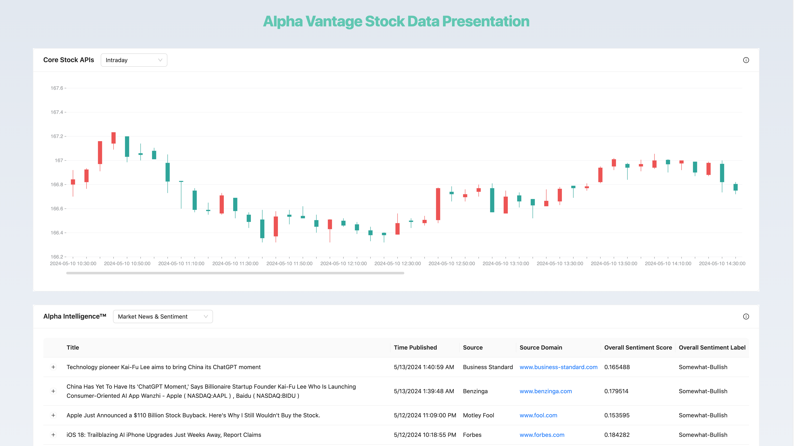

# Alpha Vantage Test Demo

This is a [Next.js](https://nextjs.org/) project created for [https://www.alphavantage.co/documentation/](https://www.alphavantage.co/documentation/).

## Functions ⚡

- **Core Stock APIs:** This suite of APIs provide global equity data in 4 different temporal resolutions: (1) daily, (2) weekly, (3) monthly, and (4) intraday, with 20+ years of historical depth. A lightweight ticker quote endpoint and several utility functions such as ticker search and market open/closure status are also included for your convenience.
- **Alpha Intelligence™:** The APIs in this section contain advanced market intelligence built with our decades of expertise in AI, machine learning, and quantitative finance. We hope these highly differentiated alternative datasets can help turbocharge your trading strategy, market research, and financial software application to the next level.
- **Economic Indicators:** APIs under this section provide key US economic indicators frequently used for investment strategy formulation and application development.
- **Technical Indicators:** Technical indicator APIs for a given equity or currency exchange pair, derived from the underlying time series based stock API and forex data. All indicators are calculated from adjusted time series data to eliminate artificial price/volume perturbations from historical split and dividend events.
---



---

## Getting Started 🤔

To get started with this template, you just need to follow these simple steps:

1. Clone the repository:

   ```
   git clone git@github.com:JakeXu/alphavantage_test_demo.git
   ```

2. Install dependencies:

   ```bash
    npm i
    # or
    yarn
    # or
    pnpm i
    # or
    bun install
    ```

3. Move `.env.example` file to `.env` and add the values for the following keys:
   > Use demo apikey instead of real apikey because always get error ino 'Thank you for using Alpha Vantage! Our standard API rate limit is 25 requests per day. Please subscribe to any of the premium plans at https://www.alphavantage.co/premium/ to instantly remove all daily rate limits.'
   
   ```dotenv
    NEXT_PUBLIC_API_KEY=demo
   ```

4. Run locally

   ```bash
    npm run dev
    # or
    yarn dev
    # or
    pnpm dev
    # or
    bun dev
    ```

## Deploy on Vercel

The easiest way to deploy your Next.js app is to use the [Vercel Platform](https://vercel.com/new?utm_medium=default-template&filter=next.js&utm_source=create-next-app&utm_campaign=create-next-app-readme) from the creators of Next.js.

Check out our [Next.js deployment documentation](https://nextjs.org/docs/deployment) for more details.


### License

Starter is [MIT licensed](./LICENSE).
